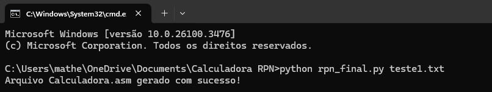
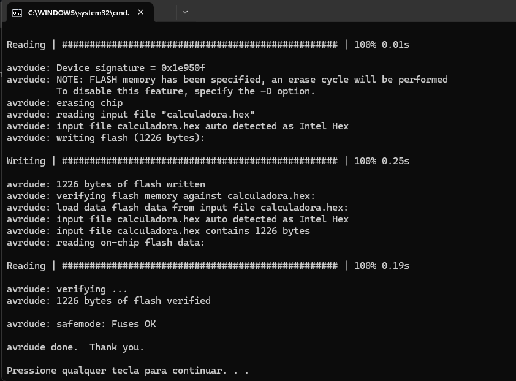
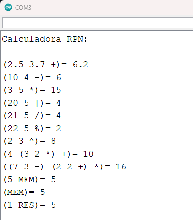

# Interpretador RPN para Arduino

## Descrição
Programa que lê expressões aritméticas em notação polonesa reversa (RPN), gera código Assembly e executa as operações em Arduino. Suporta operações matemáticas com números reais (IEEE754).

## Integrantes - Grupo 04
- Gabriel Martins Vicente
- Javier Agustin Aranibar González
- Matheus Paul Lopuch
- Rafael Bonfim Zacco

## Funcionalidades
- Leitura de expressões RPN de arquivos de texto
- Suporte para operações: adição (+), subtração (-), multiplicação (*), divisão real (|), divisão de inteiros (/), resto (%), potenciação (^)
- Processamento de expressões aninhadas
- Comandos especiais:
  - `(N RES)`: recupera o resultado de N linhas anteriores
  - `(V MEM)`: armazena um valor V na memória
  - `(MEM)`: recupera o valor armazenado na memória
- Geração de código Assembly para Arduino
- Execução em Arduino Uno/Mega

## Requisitos
- Python, C ou C++ (compilador/interpretador instalado)
- Arduino IDE (para upload do código Assembly gerado)
- Arduino Uno ou Mega

## Como usar
### 1. Faça o download desse repositório, salve os arquivos todos em uma pasta.
### 2. Prepare um arquivo de texto com expressões RPN (uma por linha)
### 3. Execute o programa passando o arquivo como argumento:
   
```python <código> <arquivo com expressões>```
> Exemplo: python rpn_final.py teste1.txt

Este comando lê o arquivo com expressões RPN e gera o código em assembly (calculadora.asm)

### 4. Compilar e carregar no Arduino
Siga os passos abaixo para compilar o código assembly e carregá-lo no Arduino:

#### Compilar o código assembly para objeto

```avr-as -mmcu=atmega328p -o calculadora.o calculadora.asm```

- Especifica que o código é para o microcontrolador ATmega328p
- Gera um arquivo objeto com as instruções de máquina

### 5. Converter objeto para executável

```avr-ld -o calculadora.elf calculadora.o```

- Converte o arquivo objeto para o formato ELF (Executable and Linkable Format)
- O arquivo ELF contém tudo que é necessário para o programa executar

### 6. Converter executável para hexadecimal

```avr-objcopy -O ihex calculadora.elf calculadora.hex```

- Converte o arquivo executável para o formato hexadecimal
- Este é o formato que pode ser carregado no microcontrolador

### 7. Transferir para o Arduino

```avrdude -p atmega328p -c arduino -P COM3 -U flash:w:calculadora.hex```

(Altere baseado na sua PORTA COM e Arduino).
- Transfere o código hexadecimal para o Arduino
- Especifica o tipo de microcontrolador (ATmega328p)
- Define o programador (Arduino)
- Indica a porta de comunicação serial do PC
- Especifica o arquivo a ser gravado
- Após este comando, o código será executado automaticamente no Arduino

### 8. Facilidade

[Compilador .bat](compilar.bat)

Esse arquivo .bat já faz essa compilação toda para facilitar e pular essas etapas!

### 9. Arquivos .txt

Os arquivos .txt contem as expressões aritméticas prontas para serem testadas, mas você pode mesmo criar o seu .txt

### 10. Exemplo de teste

Utilizando o arquivo .txt (teste1)



Utilizando o [Compilador .bat](compilar.bat) para enviar ao Arduino



Resultado no Serial Monitor do Arduino



Arquivo .txt (teste1) que foi utilizado

```
(2.5 3.7 +)
(10 4 -)
(3 5 *)
(20 5 |)
(21 5 /)
(22 5 %)
(2 3 ^)
(4 (3 2 *) +)
((7 3 -) (2 2 +) *)
(5 MEM)
(MEM)
(1 RES)
```

