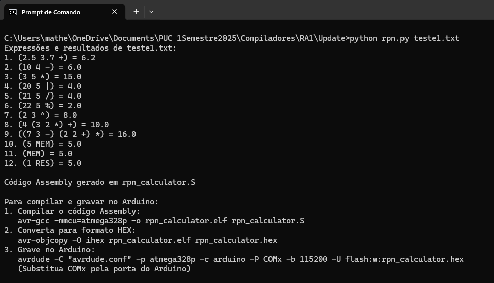
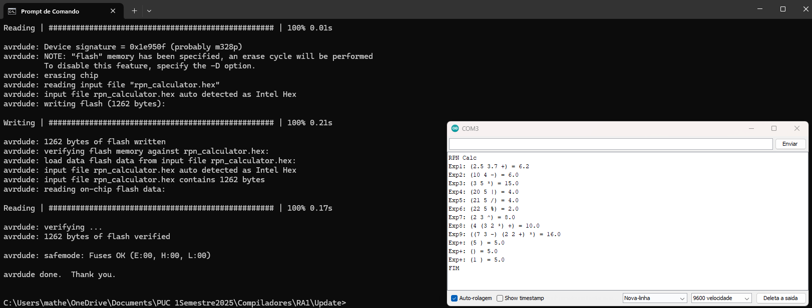

# Atividade Avaliativa – RA1 
## Calculadora RPN para Arduino
### Este programa lê expressões RPN de um arquivo de texto, calcula os resultados
### e gera código Assembly que exibe tanto as expressões quanto seus resultados.
---
#### Gabriel Martins Vicente
#### Javier Agustin Aranibar González
#### Matheus Paul Lopuch
#### Rafael Bonfim Zacco
---
Este projeto implementa uma calculadora RPN para Arduino. O programa é capaz de:
1. Ler expressões RPN de um arquivo de texto
2. Calcular os resultados das expressões
3. Gerar código Assembly para o Arduino
4. Executar as expressões no Arduino e mostrar os resultados via comunicação serial
---
Características:
- Adição: + no formato (A B +)
- Subtração: - no formato (A B -)
- Multiplicação: * no formato (A B *)
- Divisão Real: | no formato (A B |)
- Divisão de Inteiros: / no formato (A B /)
- Resto da Divisão: % no formato (A B %)
- Potenciação: ^ no formato (A B ^)
- (N RES): devolve o resultado da expressão que está N linhas antes
- (V MEM): armazena um valor V em memória
- (MEM): devolve o valor armazenado na memória
---
Como executar:
#### 1. Preparação: 
- Salve todos os arquivos do projeto no mesmo diretório.
  
#### 2. Execução do Programa Python
- ```bash
  python rpn.py teste1.txt
(Exemplo utilizando as Expressões Aritméticas 1)



Esse comando irá:
- Ler as expressões do arquivo especificado
- Calcular os resultados das expressões
- Gerar o arquivo Assembly rpn_calculator.S
- Mostrar instruções para compilação e upload

#### 3. Compilação e Upload para o Arduino
(Para realizar esses comandos é necessário ter o WinAVR instalado no seu PC).

Basta seguir as etapas de instalação normalmente.

[Link de Download](https://sourceforge.net/projects/winavr/)

Após o Download, execute os comandos em ordem:


- ```bash
  avr-gcc -mmcu=atmega328p -o rpn_calculator.elf rpn_calculator.S
avr-gcc compila esse código em um executável binário (.elf).
- ```bash
  avr-objcopy -O ihex rpn_calculator.elf rpn_calculator.hex
avr-objcopy converte o executável em formato Intel HEX (.hex).
- ```bash
  avrdude -C avrdude.conf -p atmega328p -c arduino -P COM3 -b 115200 -U flash:w:rpn_calculator.hex
avrdude carrega o arquivo HEX no Arduino (Substitua o "COM3" baseado na sua porta).

#### 4. Visualização de Resultados
- Abra o Monitor Serial com baud rate de 9600 para ver os resultados.
  


> Esse foi um exemplo de execução para as Expressões Ariméticas do teste1.txt,
> 
> Para as outras Expressões Aritméticas basta seguir o mesmo procedimento.
---
Expressões Aritméticas utilizadas:
- Teste 1 (teste1.txt)
  ```bash
  (2.5 3.7 +)
  (10 4 -)
  (3 5 *)
  (20 5 |)
  (21 5 /)
  (22 5 %)
  (2 3 ^)
  (4 (3 2 *) +)
  ((7 3 -) (2 2 +) *)
  (5 MEM)
  (MEM)
  (1 RES)

Teste básico com todas as operações elementares e os comandos MEM e RES

- Teste 2 (teste2.txt)
  ```bash
  (3.14 2.0 +)
  (10.5 3.5 -)
  (4.0 2.5 *)
  (8.0 2.0 |)
  (9.0 2.0 /)
  (9.0 2.0 %)
  (2.0 3.0 ^)
  ((5.0 2.0 +) (3.0 1.0 -) *)
  (10.0 MEM)
  (MEM 2.0 +)
  (1 RES)
  (2 RES)

Teste com valores de ponto flutuante, expressões aninhadas e uso mais elaborado do MEM e RES

- Teste 3 (teste3.txt)
  ```bash
  (2.5 1.5 +)
  (10.0 5.0 -)
  (4.0 5.0 *)
  (20.0 4.0 |)
  (21.0 4.0 /)
  (21.0 4.0 %)
  (2.0 4.0 ^)
  ((3.0 2.0 *) (1.0 1.0 +) +)
  (100.0 MEM)
  (MEM)
  (MEM 50.0 -)
  (1 RES)
  (2 RES)
  ((1 RES) (2 RES) +)

Teste mais completo com expressões aninhadas complexas e uso encadeado do comando RES

---

Estrutura do Código Assembly Gerado:
- Configura a pilha do Arduino
- Inicializa a UART para comunicação serial
- Imprime a mensagem inicial "RPN Calc"
- Mostra a expressão (Exp1, Exp2, etc.)
- Processa a expressão
- Mostra o resultado
- Finaliza com mensagem "FIM"
---
> As operações são executadas com números reais de meia precisão (16 bits/ IEEE754)
> 
> O expoente da operação de potenciação é sempre um inteiro positivo
> 
> A divisão de inteiros e o resto da divisão são executados com valores inteiros
